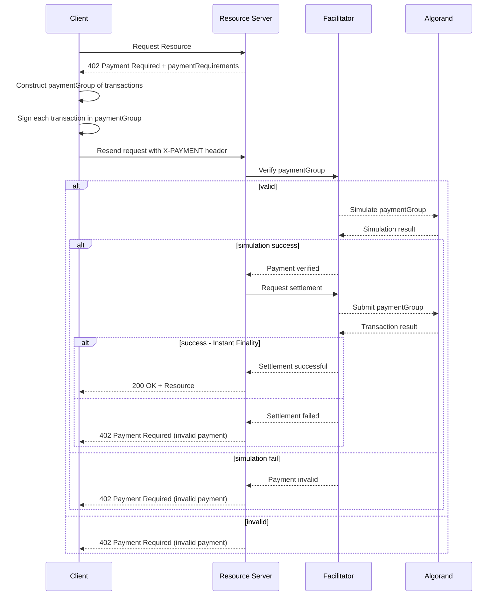

# Scheme: `exact` on `Algorand`

## Summary

The `exact` scheme on Algorand uses the Algorand Standard Asset (ASA), native assets (no contract required) of the Algorand protocol, to authorize a transfer of a specific amount from the payor to the resource server. The approach results in the facilitator having no ability to direct funds anywhere but the address specified by the resource server in `paymentRequirements`.

## Payment Requirements asset definition 

In the `exact` scheme on Algorand, the `paymentRequirements.asset` **MUST** be a string representing an ASA ID (64-bit unsigned integer) instead of an `ERC20` contract address. This **MUST** be validated by the resource server to ensure the `asset` field is valid when using the Algorand scheme.


## `X-Payment` header payload

The `payload` field of the `X-PAYMENT` header **MUST** contain `paymentGroup` as a field. It represents an atomic group of transactions as an array. Transaction groups are natively supported by the Algorand protocol (no contract required), enabling the execution of several transactions (even with different authorizers) processed atomically (no partial execution is allowed, either all the transactions in the group succeed or the entire group is rejected).

A group can contain several different types of transactions, such as `pay` (transfer of ALGO native protocol asset) and `axfer` (transfer of generic ASA), and others (for further details on supported transaction types, refer to the [Algorand transactions documentation](https://dev.algorand.co/concepts/transactions/reference/).

As part of the payload there **MUST** also be a `paymentTxID` field which identifies the transaction in the group that will pay the resource server. The group may perform several operations to facilitate the payment, such as swaps or asset transfers, but only one transaction in the group will actually transfer the funds to the resource server.

> In a single standalone transaction, the `paymentTxID` equals the only transaction ID.

Multiple signers can be in the group, and fees can be pooled together or assigned to a specific signer, meaning they can be delegated to a specific account to pay the fees for the group. A group can include a maximum of:

- 16 _top-level transactions_, authorized either with a single signature (`Ed25519`), a `k-of-n` threshold multi-signature, or a logic signature;
- 256 _inner transactions_, authorized by an application (smart contract).

The `paymentTxID` **MUST** be one of a _top-level transaction_.

Example of an USDC asset transfer with an abstracted fee (i.e paid by someone else in the group):

```json
{
  "paymentTxID": "R4PFEBJGLXV4PDOIBLY7UKBLVLXFCPYLXGBILC22BAVILTKWV3TA", // ID of the transaction in the group that wll pay the resource server
  "paymentGroup": [
    {
      "signature": "wVGxbZwPd2c8zKX4RSE4muFRBOHe/nRq5VT6iMeMksi2agfOCTs+VzOGUPJ+bTT5T21EuYjoBKKDX2+/NZG8Cg==",
      "txn": {
        "gen": "mainnet-v1.0",
        "grp": "abcd1234efgh5678ijkl9012mnop3456qrst7890uvwx1234yzab5678cdef9012",
        "gh": "SGO1GKSzyE7IEPItTxCByw9x8FmnrCDexi9/cOUJOiI=",
        "snd": "PPNHVQJGE6ZMEWPR35UHLUYMCCZV6VNTHLJMZDVCONXKUPV47K4WGQJWGI",
        "aamt": "1000000",
        "arcv": "ACTSMNPJPS5JMZJJ5G73JOXUUMWXXDGS7TMOER3M4W7BC54ERSZ4KPSMHM",
        "type": "axfer",
        "fee": "0",
        "fv": "6631154",
        "lv": "6632154",
        "xaid": "31566704"
      }
    },
    {
      "signature": "6iYMGg8cMw0VYYCfmwru8lixfrVyi1LFXm9H/M0MGf0P4vjK6KGsiCUvsocWUvMo8yTMWQ0hFcP86sRoyGlIAg==",
      "txn": {
        "gen": "mainnet-v1.0",
        "grp": "abcd1234efgh5678ijkl9012mnop3456qrst7890uvwx1234yzab5678cdef9012",
        "gh": "SGO1GKSzyE7IEPItTxCByw9x8FmnrCDexi9/cOUJOiI=",
        "fee": "2000",
        "fv": "6631154",
        "lv": "6632154",
        "snd": "LOXIQKHRCEDEMN5MKBQ32Y54J7H6JKBTEURQL4S65K44MTWN6UMTU2WNBM",
        "rcv": "LOXIQKHRCEDEMN5MKBQ32Y54J7H6JKBTEURQL4S65K44MTWN6UMTU2WNBM",
        "amnt": "0",
        "type": "pay"
      }
    }
  ]
}
```

## Sequence of operations




## Signature Scheme

Each _top-level transaction_ in the `paymentGroup` **MUST** be signed individually by each of the owners of the sender addresses in the group.

In Algorand, signatures of _top-level transactions_ are based either on:

- A `Ed25519` single signature scheme (`sig`);
- A `k-of-n` threshold [multi-signature](https://dev.algorand.co/concepts/transactions/signing/#multisignatures) (`msig`);
- A [Logic Signature](https://dev.algorand.co/concepts/smart-contracts/logic-sigs/), verified by the Algorand Virtual Machine (`lsig`);

The `signature` field in the `X-PAYMENT` header payload is a base64 encoded string of the signed transaction.

### Algorand Addresses and Public Key relationship

In Algorand, addresses are 58-character base32-encoded representations of either:

- Public keys, with a sha512_256 checksum (last 4 bytes) appended as a suffix. This encoding ensures that addresses can be derived directly from public keys without requiring a pre-existing signature for operations like `ecRecover` to verify signatures.
- SHA512_256 of the Logic Signatures program bytecode + `Program` as a prefix.

#### Example of encoding Algorand addresses:

```ts
	encodeAddress(publicKey: Buffer): string {
		const keyHash: string = sha512_256.create().update(publicKey).hex()

		// last 4 bytes of the hash
		const checksum: string = keyHash.slice(-8)

		return base32.encode(Encoder.ConcatArrays(publicKey, Buffer.from(checksum, "hex"))).slice(0, 58)
	}
```


### Encoding

#### Types

Before encoding, all `txn` parameters **MUST** be converted into primitive types:

Header Fields (common to any transaction type):

- `fee`: The fee for the transaction paid by the sender should be converted into a uint64 integer.
- `fv`: The first valid round of the transaction should be converted into a uint64 integer.
- `lv`: The last valid round of the transaction should be converted into a uint64 integer.
- `gh`: The genesis hash of the network, which is a base64 encoded string should be decoded. 
- `snd`: The sender address should be decoded into its public key bytes.
- `type`: The transaction type is a string.
- `grp`: Is the 32-bytes transaction group identifier.

ALGO Transfer fields (`pay`):
- `rcv`: The receiver address should be decoded into its public key bytes.
- `amt`: The amount of microALGO to transfer should be converted into a uint64 integer.

ASA transfer fields (`axfer`)
- `xaid`: The unique ASA ID should be converted into a uint64 integer.
- `aamnt`: The ASA amount to transfer should be converted into a uint64 integer.
- `arcv`: The ASA receiver address should be decoded into its public key bytes.
- `asnd`: The ASA sender address should be decoded into its public key bytes.

> The ASA sender (`asnd`) field should be set to the zero value for _regular_ ASA transfers between accounts. If this value is non-zero and different from the sender field (`snd`) in the header, the transaction is a _forced_ ASA transfer, where the _sender_ (`snd`) is the ASA’s _clawback address_ and the _asset sender_ (`asnd`) is the address from which the funds will be withdrawn.

#### Scheme

Algorand uses [**msgpack**](https://www.npmjs.com/package/algorand-msgpack) to encode the transaction before signing.


#### Steps to sign

- Decode the `txn` parameters as described above.
- Sort fields alphabetically. 
- Encode the sorted fields using msgpack.
- Add a prefix `TX` in its byte representation to the encoded message.
- Sign the resulting byte array using the sender's private key with the `Ed25519` signature scheme (or other signature options, such as multi-signature or logic-signature).


## Full `X-PAYMENT` header:

```json
{
  "x402Version": 1,
  "scheme": "exact",
  "network": "algorand-mainnet",
  "payload": {
    "paymentTxID": "R4PFEBJGLXV4PDOIBLY7UKBLVLXFCPYLXGBILC22BAVILTKWV3TA", // ID of the transaction in the group that will pay the resource server
    "paymentGroup": [
      {
        "signature": "VxpW6emWwct7ymzyXa/F2T7rwepM71XwsslPKEdpVqmbcRUB28QMdYJuuLkeP4dnVoI7emmxT6Q/YktqHc8xBg==",
        "txn": {
          "gen": "mainnet-v1.0",
          "gh": "SGO1GKSzyE7IEPItTxCByw9x8FmnrCDexi9/cOUJOiI=",
          "fee": "2000",
          "fv": "6631154",
          "lv": "6632154",
          "snd": "LOXIQKHRCEDEMN5MKBQ32Y54J7H6JKBTEURQL4S65K44MTWN6UMTU2WNBM",
          "rcv": "LOXIQKHRCEDEMN5MKBQ32Y54J7H6JKBTEURQL4S65K44MTWN6UMTU2WNBM",
          "amnt": "0",
          "type": "pay"
        }
      },
      {
        "signature": "wVGxbZwPd2c8zKX4RSE4muFRBOHe/nRq5VT6iMeMksi2agfOCTs+VzOGUPJ+bTT5T21EuYjoBKKDX2+/NZG8Cg==",
        "txn": {
          "gen": "mainnet-v1.0",
          "gh": "SGO1GKSzyE7IEPItTxCByw9x8FmnrCDexi9/cOUJOiI=",
          "asnd": "PPNHVQJGE6ZMEWPR35UHLUYMCCZV6VNTHLJMZDVCONXKUPV47K4WGQJWGI",
          "arcv": "ACTSMNPJPS5JMZJJ5G73JOXUUMWXXDGS7TMOER3M4W7BC54ERSZ4KPSMHM",
          "aamt": "1000000",
          "type": "axfer",
          "fee": "0",
          "fv": "6631154",
          "lv": "6632154",
          "xaid": "31566704"
        }
      }
    ]
  }
}
```

## Verification

Steps to verify a payment for the `exact` scheme on Algorand:

1. Verify the signature is valid for each transaction in the `paymentGroup`.
  a. Encode the `txn` parameters as described in the encoding section.
  b. Recover the public key of the sender from the `snd` field by decoding from the address.
  c. Verify the signature against the encoded message using the recovered public key.
2. Verify that the atomic group of transactions is valid and can be executed as a single unit.
3. Execute the payment group against an Algorand node's `simulate` endpoint to ensure the transactions would result in the amount specified in `paymentRequirements.maxAmountRequired` being transferred to the resource server's address. The quickiest way to validate this is to check the `paymentTxID` transaction in the group transfers the correct amount to the resource server.
  3.1 `PaymentTxID` is supplied in the payment HEAD, but can and **SHOULD** be calculated by hashing the encoded transaction parameters with SHA512_256 and encoding the result in base32 with a length of 52 characters.

## Settlement

Once the group is validated by the resource server, settlement can occur by the facilitator submitting the `paymentGroup` to the Algorand network through the `v2/transactions` endpoint against any valid Algorand node.

In Algorand there are no consensus forks and so it achieves finality instantly a transaction is included in a block. So as soon as the transaction is included in a block, the payment is considered settled and the facilitator can inform the resource server of the successful payment and proceed with the resource delivery.

## Additional Considerations

- In order for the resource server to receive payment on a particular Asset, it **MUST** be opted-in to that asset.

In Algorand, accounts explicitly enable receiving a particular asset, otherwise an asset transfer to that account will be rejected. So as part of the resource server's setup, it **SHOULD** ensure it has opted-in to the asset ID specified in the `paymentRequirements.asset`.

